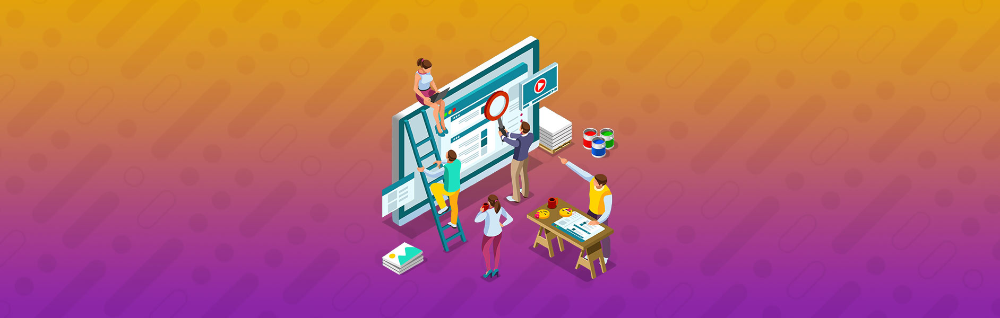

# Desenvolvimento Front-end

## Introdução à React

[Movie Cards Library](./sd-07-project-movie-cards-library/)

Desenvolvi meu primeiro site usando React : uma biblioteca de cartões contendo informações sobre filmes.

## Componentes com Estado, Eventos e Formulários com React

[Movie Cards Library Stateful](./sd-07-project-movie-card-library-stateful)

Uma evolução do projeto anterior, tornando a biblioteca anterior dinamica.

## Ciclo de Vida de Componentes e React Router

[Movie Cards Library CRUD](./sd-07-project-movie-card-library-crud)

Neste projeto aprendemos a utilizar rotas, e finalizamos a biblioteca de filmes.
As novas funcionalidades são Adicionar, remover e modificar filmes (CRUD)

## Metodologias Ágeis

[Frontend Online Store](./sd-07-project-frontend-online-store)

Primeiro projeto desenvolvido em grupo, o objetivo desse projeto foi desenvolver um site que faz buscas utilizando a api do Mercado Livre. O foco foi na organização utilizando o trello.

## Testes automatizados com React Testing Library

[Testes em React](./sd-07-project-react-testing-library)

Colocando em pratica os conhecimentos adquiridos sobre testes com React Testing Library

[Testes](sd-07-project-react-testing-library/src/tests)

## Gerenciamento de estado com Redux

[Trybe Wallet](./sd-07-project-trybewallet)

Neste projeto aplicamos os conhecimentos adquiridos sobre Redux.
Aqui o usuario pode armazenar suas despesas, foi utilizada uma api para converter as moedas utilizadas para real.

## Projeto Jogo de Trivia

[Jogo de Trivia](./sd-07-project-trivia-react-redux)

Criamos um jogo de perguntas e respostas, utilizando redux. O foco do projeto foi novamente trabalhar em grupo utilizando o Trello.

Imagens do Trello

Imagens do projeto

## Context API e React Hooks

[StarWars Datatable](./sd-07-project-starwars-datatable-hooks)

Projeto realizado utilizando React Hooks e uma API que contem todos os dados dos filmes Star Wars. O objetivo do projeto é filtrar os dados retornados da api utilizando React Hooks.

[StarWars Datatable](./sd-07-project-starwars-datatable-hooks)

## Projeto App de Receitas

[App de Receitas](./sd-07-project-recipes-app)

Projeto de conclusão de módulo, o APP (desenvolvido para mobile) foi o maior projeto que desenvolvi no curso. Foram 2 semanas de desenvolvimento em grupo.

O app consome 2 APIs que retornam receitas de comidas e bebidas.

